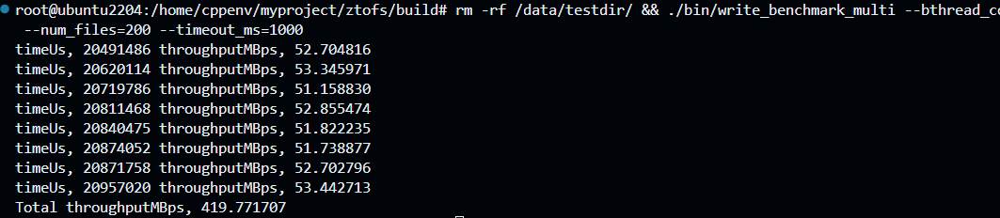
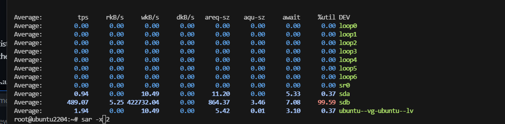
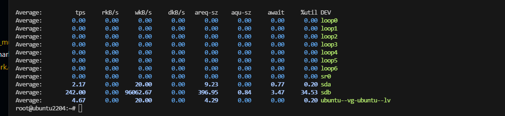
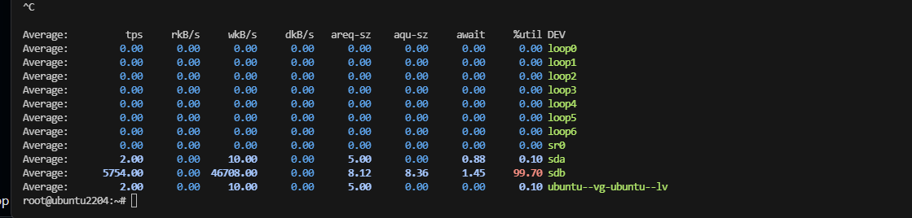
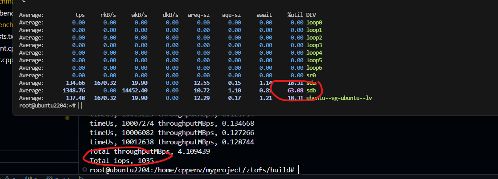
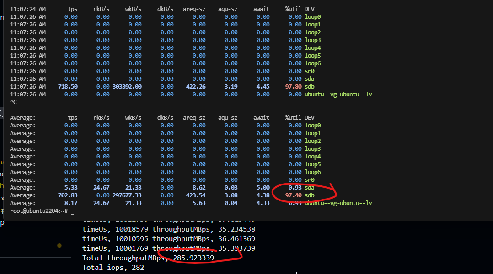
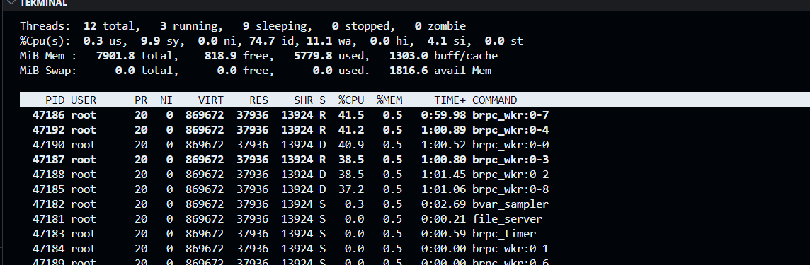
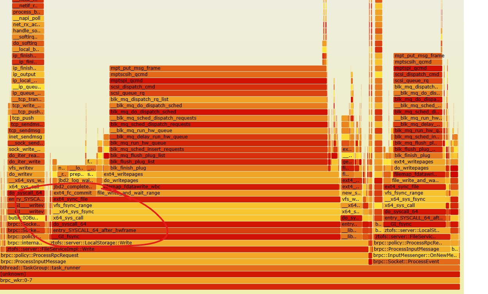

# 版本1

## 版本1 说明

版本1的架构 是简单的同步架构, 

file_service 接收网络请求, 反序列化proto。根据请求调用meta和storage层处理
```
- file_service

    - meta 层， 包括create, remove, lookup, getattr, setattr 等接口
        - 访问本地文件系统 open_by_handle, name_to_handle, stat 等接口
    
    - data 层, 包括read, write接口
        - 访问本地文件系统 pread, pwrite等接口
```

网络层使用的brpc, 简单说下。brpc 核心是四块, 网络库、bthread、bvar和butil。网络库顾名思义就是epoll+事件处理, bthread是协程+任务队列，butil 是工具库, bvar 用来做监控metrics。

brpc server启动时会设置线程数, 之后只用bthread处理, 默认所有bthread共用线程池（可用bthread_tag根据server拆分线程池）。可以通过设置bthread的meta 来指定bthread在哪个线程执行, 默认会自动选择一个线程执行bthread。

server启动时，根据监听的端口，创建若干socket和可读事件加入到事件模块，随后处理交给事件模块，server等待直到终止信号。事件模通过多个bthread(FLAGS_event_dispatcher_num控制) 用来epoll wait和事件处理。每个socket 有IOEvent对象，设置了InputEventCallback、OutputEventCallback; 即事件处理函数，分别在epoll 触发EPOLLIN和EPOLLOUT 时执行。

架构1 就是利用brpc的sever和事件处理模块接收处理网络请求，service层转发到meta/storage层, 最后调用文件系统调用处理和返回。

## 架构1 的优点和问题

### 优点
优点，简单

### 缺点
缺点，
1. server fsync 操作最影响性能，开启fsync 后4K随机/顺序写磁盘利用率只有66%
2. 处理网络请求和磁盘IO的是相同bthread，也就是说不同的bthread可能操作同一文件, 会有数据竞争问题
3. 服务无状态, 每次操作都要open文件，这个对元数据影响会更突出

### 优化点

1. 支持异步延迟fsync, 有数据丢失的时间窗口，但可以大幅提高性能
2. 创建一个io线程池，负责操作文件系统调用操作
3. cache住已经打开的文件, 每次操作重新open文件改为先从cache里拿

## 性能测试 server 未开启fsync

机器环境
笔记本(性能较差) 使用vmware 虚拟机, 虚拟机配置

cpu


内存, 8G

磁盘, vmware虚拟出的一个20G磁盘，挂载在/data目录

操作系统, Linux ubuntu2204 5.15.0-153-generic

### 单机1M写吞吐

多bthread并发写10个文件 10个文件，每个文件100M，iosize 1M。

rm -rf /data/testdir/ && ./bin/rw_benchmark_multi --bthread_count=8 --run_time_sec=10 --timeout_ms=1000 --seq_io=false
file_server关键参数:
--mount_path=/data --event_dispatcher_num=4 --thread_num=8 --max_concurrency=8
* fs 根目录路径为/data
* event_dispatcher_num=4, 表示启动4个bthread 用来处理tcp连接创建和网络事件
* thread_num=8, 表示file_servre总共启动8个线程
* 


顺序写吞吐约400MB/s

sar -d -p 2监控



可以看到disk_util = 99.59，说明方案一虽然粗糙，但是也把磁盘打满了


1M随机写也是400MB左右, 磁盘利用率100%

### 单机4K写IOPS

4K 顺序写

rm -rf /data/testdir/ && ./bin/rw_benchmark_multi --bthread_count=8 --run_time_sec=10 --timeout_ms=1000 --seq_io=true --io_size=4

8 bthread 发压, iops = 8073

16 bthread, iops = 13197

32 bthread, iops = 23813

64 bthread, iops = 33306

数值这么高的原因，应该是page cache立大功!

* 4K 随机写

8 bthread, iops = 7656

16 bthread, iops = 10371

32 bthread, iops = 9463

可以看到4K 随机写iops 稳定在1w左右(为什么?)


32 bthread 4K顺序写 iops 24000, disk_util 为33%


4K随机写 iops 9000, disk_util 为100%



## 性能测试, server 开启fsync

32 bthread 4K顺序写 iops 1035, disk_util 为63%



32 bthread 4K随机写 iops 1138, disk_util 为67%

8 thread 1M 顺序写, 吞吐 282MB/s
rm -rf /data/testdir/ && ./bin/rw_benchmark_multi --bthread_count=8 --run_time_sec=10 --timeout_ms=1000 --seq_io=true --io_size=1024 --file_size=1024


 
8 thread 1M 随机写, 吞吐276MB/s
rm -rf /data/testdir/ && ./bin/rw_benchmark_multi --bthread_count=8 --run_time_sec=10 --timeout_ms=1000 --seq_io=false --io_size=1024 --file_size=1024

### 火焰图分析

32 bthread 4K顺序写 iops 1035, disk_util 为63%

线程cpu占用情况，主要由5个处理线程


火焰图，可以看到绝大多数耗时在fsync


btw, 火焰图能看整体性能但无法看长尾性能。长尾性能（主要是延迟）还是得通过分析长尾trace

## 总结

### 1M 写吞吐
在server不开fsync的情况下, 1M 随机写和顺序写 都能打满磁盘, 吞吐约为400MB/s。

server开fync情况下, 1M 随机写和顺序写 也都能打满磁盘, 吞吐约为280MB/s。

在这种测试场景下, 架构一对大IO读写吞吐来说已经足够

### 4K 写iops

server 不卡fsync情况下, 4K顺序写iops 能超3w，但磁盘利用率只有30%，应该是page cache提高性能的原因（写磁盘转为写缓存），4K随机写iops 1w左右, 磁盘能打满。

server 开fsync情况下, 4K顺序写和随机写iops 都在1000左右，且磁盘利用率均在66%左右。

开启fsync情况下，可以尝试优化让4K随机写和顺序写 的磁盘利用率提升到100%，iops 应该能上升到1500。但是优化sync 本身, 收益会更高